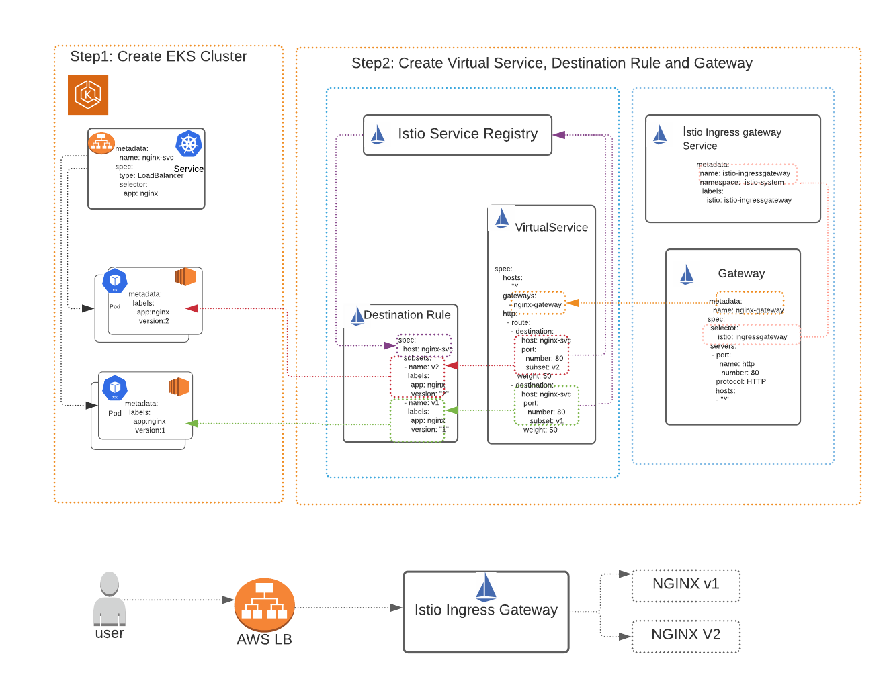
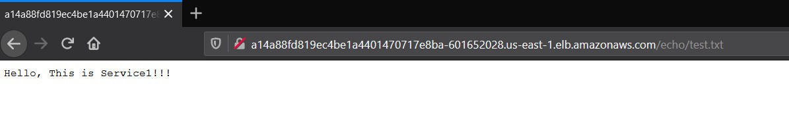
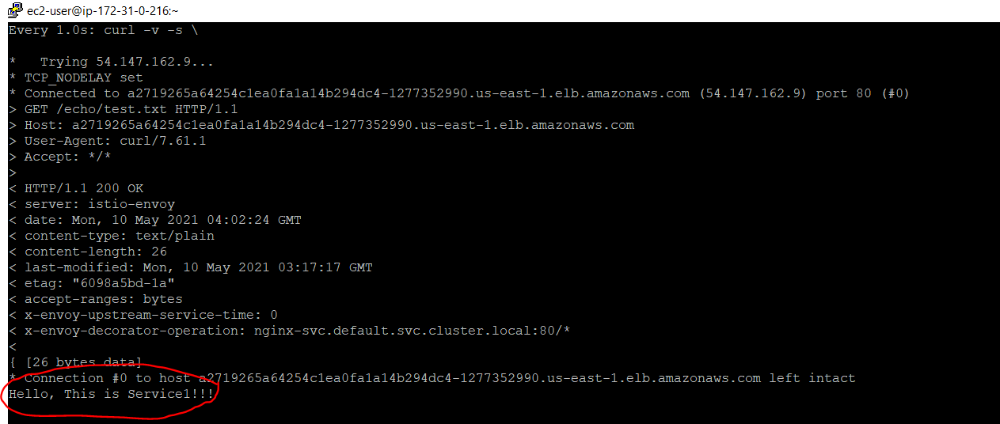

**##Introduction##**

The goal of this project is to demonstrate creation of a load balancer using EKS in Istio and explore destinationrule and dashboard features in Istio.

To achieve the above goal, I'll use the following topology:



 1. This project uses Amazon EKS cluster with 2 nodes to setup basic NGINX services. 
 2. Using "Load balancer" type in Service  will create AWS load balancer. 
 3. I used Istio for traffic management and load balancing as it has more options and also to visualize in dashboard. 


**##### Environment Setup #####**

I am using AWS CLI to create cluster. Assuming that all prerequisites(VPC, IAM role permissions and Security group) are met, please follow below steps

1. Create EC2 instance and Upgrade AWS CLI:

```
curl "https://awscli.amazonaws.com/awscli-exe-linux-x86_64.zip" -o "awscliv2.zip"
unzip awscliv2.zip
sudo ./aws/install
```


2. Configure EC2 to have AWS cli permissions.
3. Install eksctl and kubectl 

eksctl:

```
curl --silent --location "https://github.com/weaveworks/eksctl/releases/latest/download/eksctl_$(uname -s)_amd64.tar.gz" | tar xz -C /tmp
sudo mv /tmp/eksctl /usr/local/bin
eksctl version
```

kubectl:
```
curl -o kubectl https://amazon-eks.s3.us-west-2.amazonaws.com/1.19.6/2021-01-05/bin/linux/amd64/kubectl
chmod +x ./kubectl
mkdir -p $HOME/bin && cp ./kubectl $HOME/bin/kubectl && export PATH=$PATH:$HOME/bin
kubectl version --short --client
```


4. create cluster

`eksctl create cluster --name nginx --version 1.19 --region us-east-1 --nodegroup-name standard-workers --node-type m5.large  --nodes 2 --nodes-min 2 --nodes-max 3 --managed --zones us-east-1a,us-east-1b`

-  Above command creates 3 cloud formation templates, it will take ~15-20mins to setup EKS cluster. 

```
[ec2-user@ip-172-31-0-216 ~]$ eksctl get cluster
2021-05-10 12:47:50 [ℹ]  eksctl version 0.48.0
2021-05-10 12:47:50 [ℹ]  using region us-east-1
NAME    REGION          EKSCTL CREATED
nginx   us-east-1       True
```


6. Install istio

```
curl -L https://istio.io/downloadIstio | sh -
cd istio-1.9.4
export PATH=$PWD/bin:$PATH
istioctl install --set profile=demo -y
kubectl label namespace default istio-injection=enabled

```

**######  Deploying the application ######**

**Step1: Create Deployment and Service**

- Deploy nginx application, by running the following command

`kubectl apply -f nginx-deployment.yml`

```
[ec2-user@ip-172-31-0-216 ~]$ kubectl apply -f nginx-deployment.yml 
configmap/nginx-static-files created
deployment.apps/nginx-v2 created
deployment.apps/nginx-v1 created
```

- Run below commands to verify the output, provided sample outputs in each section.


```
[ec2-user@ip-172-31-0-216 ~]$ kubectl get deployment
NAME       READY   UP-TO-DATE   AVAILABLE   AGE
nginx-v1   2/2     2            2           17m
nginx-v2   2/2     2            2           17m
```


```
[ec2-user@ip-172-31-0-216 ~]$ kubectl get pods
NAME                        READY   STATUS    RESTARTS   AGE
nginx-v1-85774d6bff-8kmnp   2/2     Running   0          17m
nginx-v1-85774d6bff-lzm2c   2/2     Running   0          17m
nginx-v2-7cf854fcd5-4gjtp   2/2     Running   0          17m
nginx-v2-7cf854fcd5-kqkln   2/2     Running   0          17m
```


```
[ec2-user@ip-172-31-0-216 ~]$ kubectl get services
NAME         TYPE           CLUSTER-IP     EXTERNAL-IP                                                               PORT(S)        AGE
kubernetes   ClusterIP      10.100.0.1     <none>                                                                    443/TCP        59m
nginx-svc    LoadBalancer   10.100.27.10   a2719265a64254c1ea0fa1a14b294dc4-1277352990.us-east-1.elb.amazona
```

**Step2: Create Virtual Service, Destination Rule and Gateway**

-  Run the following command

` kubectl apply -f nginx-gateway.yml`

```
[ec2-user@ip-172-31-0-216 ~]$ kubectl apply -f nginx-gateway.yml
destinationrule.networking.istio.io/nginx created
gateway.networking.istio.io/nginx-gateway created
virtualservice.networking.istio.io/nginx created
```

- To make sure there are no errors, please run below command

```
ubuntu@ubuntu2004:~/nginx-kubernetes-deployment$ istioctl analyze

✔ No validation issues found when analyzing namespace: default.

```

- you can run below commands to see gateway and virtualservice

```
[ec2-user@ip-172-31-0-216 ~]$ kubectl get gateway
NAME            AGE
nginx-gateway   16m
[ec2-user@ip-172-31-0-216 ~]$ kubectl get virtualservice
NAME    GATEWAYS            HOSTS   AGE
nginx   ["nginx-gateway"]   ["*"]   17m
```

kubectl get svc istio-ingressgateway -n istio-system

```
[ec2-user@ip-172-31-0-216 ~]$ kubectl get svc istio-ingressgateway -n istio-system
NAME                   TYPE           CLUSTER-IP      EXTERNAL-IP                                                               PORT(S)                                                                      AGE
istio-ingressgateway   LoadBalancer   10.100.46.195   acc8df81a61234480a3c434cb7dcb386-1026172900.us-east-1.elb.amazonaws.com   15021:30071/TCP,80:31731/TCP,443:31468/TCP,31400:32073/TCP,15443:30957/TCP   103m
```

**Step3 : Testing**

-  Run below commands to get the port number and LB DNS information. 

```
  export INGRESS_HOST=$(kubectl -n istio-system get service istio-ingressgateway -o jsonpath='{.status.loadBalancer.ingress[0].hostname}')
  export INGRESS_PORT=$(kubectl -n istio-system get service istio-ingressgateway -o jsonpath='{.spec.ports[?(@.name=="http2")].port}')
  export GATEWAY_URL=$INGRESS_HOST:$INGRESS_PORT
  echo "http://$GATEWAY_URL/echo/test.txt"
```


-  Paste the output from the previous command into your web browser and you will see output.
 

-  You can curl and watch that application is load balanacing by using below command on the same node

```
  watch -n 1 'curl -v -s \
  http://$GATEWAY_URL/echo/test.txt'
```
 
  
**Step4: Access the  dashboard (Optional)**

-  I chose to use Kiali, verify it is deployed sucessfully by running below command. 

```
  kubectl create -f samples/addons
  kubectl rollout status deployment/kiali -n istio-system
```

- Run below command to view, it might ask you to install socat, please do based on your os.

 ` istioctl dashboard kiali`

#### Clean up ####
- You can delete the application by running following commands.

_To Uninstall Istio_
- _Make sure you do not have any other applications using Istio_

```
  cd istio-1.9.4
  kubectl delete -f samples/addons
  istioctl manifest generate --set profile=demo | kubectl delete --ignore-not-found=true -f -
  kubectl delete namespace istio-system
  kubectl label namespace default istio-injection-
```
_To Uninstall application, run the shell script._

```
 kubectl delete -f nginx-deployment.yml -f nginx-gateway.yml
```
_To Delete EKS Cluster_

```
[ec2-user@ip-172-31-0-216 ~]$ eksctl get cluster
2021-05-10 04:03:58 [ℹ]  eksctl version 0.48.0
2021-05-10 04:03:58 [ℹ]  using region us-east-1
NAME    REGION          EKSCTL CREATED
nginx   us-east-1       True
[ec2-user@ip-172-31-0-216 ~]$
[ec2-user@ip-172-31-0-216 ~]$ eksctl delete cluster nginx
```

### What's Next ###
- Customize cloud formation templates used to create EKS with Network and Security standards that are used at organization.
- Add end to end encryption to application
- I would add resource requirements to application and setup Autoscaling.
- For Custom sorry page, if ELB is behind cloud Front I would use cloud Front to return a custom error page from s3 bucket
- Create custom health page instead of simple liveness probe that I used to monitor pods. AWS LB has health check inbuild as well.

